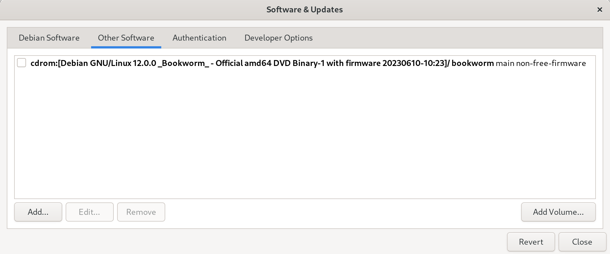

# Developer Workstation Setup Script Debian Edition


This guide provides instructions for setting up a developer workstation using Debian 12 "bookworm". The setup script automates the installation of necessary software and configurations to create an efficient development environment.

## Installation

Before running the setup script, follow these steps to install Debian 12 and configure the desktop environment:

1. Install a fresh copy of Debian 12, selecting Gnome as the desktop environment. During the installation, do not provide any details for the root account. Your user account will have administrative rights.

   > Note: If you encounter any issues related to the CD-ROM reference in `/etc/apt/sources.list`, remove it or use the Software and Updates App before proceeding.

   

2. Open the terminal and run the following command to install Ansible, Git, and Flatpak:

   ```
   sudo apt install ansible git flatpak
   ```

3. Clone the repository and navigate to it:

   ```
   git clone https://github.com/David-Else/developer-workstation-setup-script
   cd developer-workstation-setup-script
   git switch debian12
   ```

4. Customize the software selection by modifying the `install.yml` and `install-setup.bash` scripts according to your preferences.

5. Run the setup scripts:

   ```
   ansible-playbook ./install.yml -K
   ./install-setup.bash
   ```

   > Note: When prompted for the `BECOME` password in Ansible, enter your user password. Your account must have administrative privileges.

6. To enable the preview feature in the `nnn` file manager, run it once with the `-a` flag to create the FIFO file.

## Optional Tweaks

Depending on your software selection, hardware, and personal preferences, you may want to make the following changes:

### Audio

To set the available sample rates for your audio interface, follow these steps:

1. Find your audio interface(s) and available sample rates by running the following command:

   ```
   cat /proc/asound/cards
   ```

   Example output:

   ```sh
   0 [HDMI]: HDA-Intel - HDA ATI HDMI
              HDA ATI HDMI at 0xf7e60000 irq 31
   1 [USB ]: USB-Audio - Scarlett 6i6 USB
                         Focusrite Scarlett 6i6 USB at usb-0000:00:14.0-10, high speed
   ```

2. Play some audio and examine the stream for your audio interface (in this case `card1`) by running the following command *note this might not work:

   ```
   cat /proc/asound/card1/stream0
   ```

   Example output:

   ```sh
   Focusrite Scarlett 6i6 USB at usb-0000:00:14.0-10, high speed : USB Audio

   Playback:
     Status: Running
       Interface = 1
       Altset = 1
       Packet Size = 216
       Momentary freq = 48000 Hz (0x6.0000)
       Feedback Format = 16.16
     Interface 1
       Altset 1
       Format: S32_LE
       Channels: 6
       Endpoint: 0x01 (1 OUT) (ASYNC)
       Rates: 44100, 48000, 88200, 96000, 176400, 192000
       Data packet interval: 125 us
       Bits: 24
       Channel map: FL FR FC LFE RL RR
       Sync Endpoint: 0x81 (1 IN)
       Sync EP Interface: 1
       Sync EP Altset: 1
       Implicit Feedback Mode: No
   ```

   You can view the current playback sample-rate with:

   ```sh
   cat /proc/asound/card1/pcm0p/sub0/hw_params
   ```
  
3. Create a PipeWire user config file by running the following commands:

   ```
   mkdir -p ~/.config/pipewire/
   cp /usr/share/pipewire/pipewire.conf ~/.config/pipewire/
   ```

4. Edit the `~/.config/pipewire/pipewire.conf` file to add or modify the available sample rates for your sound card(s). Replace the default line with the desired sample rates, removing the `#` comment:

   ```sh
   default.clock.allowed-rates = [ 44100 48000 88200 96000 176400 192000 ]
   ```

   You can confirm the settings were changed with:

   ```sh
   systemctl --user restart pipewire.service
   pw-metadata -n settings
   ```

   and watch the sample rates change per application running `pw-top`.

    > More info can be found at: [docs.pipewire.org configuration-file-pipewireconf](https://gitlab.freedesktop.org/pipewire/pipewire/-/wikis/Config-PipeWire#configuration-file-pipewireconf)

5. Create a user config file for your PipeWire JACK settings by running the following commands:

   ```sh
   mkdir -p ~/.config/pipewire/jack.conf.d/
   cat >~/.config/pipewire/jack.conf.d/jack.conf <<EOF
   jack.properties = {
        node.latency       = 256/96000
        node.rate          = 1/96000
        node.quantum       = 256/96000
        node.force-quantum = 256
   }
   EOF
   ```
    > More info can be found at: [docs.pipewire.org configuration-file-jackconf](https://gitlab.freedesktop.org/pipewire/pipewire/-/wikis/Config-JACK#configuration-file-jackconf)

### General

To perform general tweaks, follow these steps:

- Set up Deno by creating or updating shell completions. Run the following command:

  ```sh
  deno completions bash > deno.sh
  sudo mv deno.sh /etc/profile.d
  ```

- Set up Vale by changing the global `.vale.ini` file in your `$HOME` directory. Update the `StylesPath` to point to an empty directory where you want to store your styles. For example:

  ```sh
  StylesPath = ~/Documents/styles
  ```

  After making the change, run `vale sync`. You can create a new config file using the [Config Generator](https://vale.sh/generator).

- Configure Git by setting your email and name. Run the following commands:

  ```sh
  git config --global user.email "you@example.com"
  git config --global user.name "Your Name"
  ```

  If you want to enable GPG signing for commits, use the following commands:

  ```sh
  git config --global user.signingkey key
  git config --global commit.gpgsign true
  ```

# FAQ

If you would like to use Code for things that Helix still struggles with (like debugging), and still use all the modal keyboard shortcuts, I suggest installing `silverquark.dancehelix` or `asvetliakov.vscode-neovim` and using these settings:

`settings.json`

```jsonc
{
  // font size
  "editor.fontSize": 15,
  "markdown.preview.fontSize": 15,
  "terminal.integrated.fontSize": 15,
  // asvetliakov.vscode-neovim
  "editor.scrollBeyondLastLine": false,
  "vscode-neovim.neovimExecutablePaths.linux": "/usr/local/bin/nvim", // for el9 clones, or "/usr/bin/nvim" for Fedora
  "workbench.list.automaticKeyboardNavigation": false,
  // various
  "window.titleBarStyle": "custom", // adjust the appearance of the window title bar for linux
  "editor.minimap.enabled": false, // controls whether the minimap is shown
  "workbench.activityBar.visible": false, // controls the visibility of the activity bar in the workbench
  "window.menuBarVisibility": "hidden", // control the visibility of the menu bar
  "files.restoreUndoStack": false, // don't restore the undo stack when a file is reopened
  "editor.dragAndDrop": false, // controls whether the editor should allow moving selections via drag and drop
  "telemetry.enableTelemetry": false // disable diagnostic data collection
}
```

You might also like to install `ms-vscode.live-server` for live debugging in Code or the browser.

**Q**: Does this script disable the caps lock key? I've noticed that it works during login but after that it stops working altogether.

**A**: It makes the caps lock into delete for touch typing purposes, to change it modify this line in `install.yml`:

```yml
- {
    key: "/org/gnome/desktop/input-sources/xkb-options",
    value: "['caps:backspace', 'terminate:ctrl_alt_bksp', 'lv3:rwin_switch', 'altwin:meta_alt']",
  }
```
