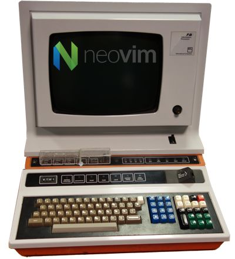

# Developer Workstation Setup Script



Are you tired of spending hours setting up your development environment every time you switch to a new machine? Look no further than the Developer Workstation Setup Script!

 This setup script uses Ansible and Bash to quickly and easily install a variety of development and general use software on both cutting edge Fedora and stable Red Hat Enterprise Linux 9 compatible distributions.

## Features

The Developer Workstation Setup Script has the following features:

- Works with both cutting edge Fedora (tested up to [38](https://download.fedoraproject.org/pub/fedora/linux/releases/38/Workstation/x86_64/iso/Fedora-Workstation-Live-x86_64-38-1.6.iso)) and stable Red Hat Enterprise Linux 9 (tested up to [9.2](https://mirrors.almalinux.org/isos/x86_64/9.2.html)) compatible distributions.
- Easy to customize, just add and remove packages/config from the scripts before running.
- Uses [stow](https://www.gnu.org/software/stow/) to install and manage dotfiles.
- Includes a variety of development and general use software:

| Development | Browsers | Graphics | Sound and video | Security and backup |
| --- | --- | --- | --- | --- |
| Helix | Firefox | Krita | MPV | KeepassXC |
| Node.js / Deno | nnn file browser | ImageMagick | Handbrake | BorgBackup |
| Kitty |  |  | MKVToolNix |  |
| Lazygit |  |  | Blender |  |
| GitHub CLI |  |  | OBS Studio |  |
| Pandoc |  |  |  |  |
| Shellcheck / Shfmt |  |  |  |  |
| Bat |  |  |  |  |
| Ripgrep |  |  |  |  |
| Delta |  |  |  |  |

## Installation

These scripts are designed to be run immediately after installing the operating system.


1. Install a fresh copy of Fedora or a Red Hat Enterprise Linux 9 compatible distribution. If you are using an el9 clone, select `workstation` from the software selection option during installation. You must also give your user account administrative privileges, this is a tick-box when you are creating the user.
2. Clone the repository and `cd` into it: `git clone https://github.com/David-Else/developer-workstation-setup-script`
3. Install Ansible:

If you are using el9, you need to first enable the epel repository:

`sudo dnf config-manager --set-enabled crb` and `sudo dnf install epel-release`.

Install Ansible and the community collection:

`sudo dnf install ansible-core ansible-collection-community-general`

4. Customize the software selection by modifying the `install.yml` and `install-setup.bash` scripts with your own software preferences.
5. Run the scripts: `ansible-playbook ./install.yml -K` and `./install-setup.bash`

Note: Your `BECOME` password in Ansible is your user password, your account must have administrative privileges.

After installation, you must run `nnn` once with `-a` to create the fifo file for the preview feature to work.

## Optional Tweaks

Based on your software selection, hardware, and personal preferences, you may want to make the following changes:

### Audio

- Set the available sample rates for your audio interface:

1. Find your audio interface(s) and available sample rates:

`cat /proc/asound/cards`

Example output:

```sh
 0 [HDMI           ]: HDA-Intel - HDA ATI HDMI
                      HDA ATI HDMI at 0xf7e60000 irq 31
 1 [USB            ]: USB-Audio - Scarlett 6i6 USB
                      Focusrite Scarlett 6i6 USB at usb-0000:00:14.0-10, high speed
```

Play some audio and examine the stream for your audio interface (in this case `card1`):

`cat /proc/asound/card1/stream0`

Example output:
   
```sh
Focusrite Scarlett 6i6 USB at usb-0000:00:14.0-10, high speed : USB Audio

Playback:
  Status: Running
    Interface = 1
    Altset = 1
    Packet Size = 216
    Momentary freq = 48000 Hz (0x6.0000)
    Feedback Format = 16.16
  Interface 1
    Altset 1
    Format: S32_LE
    Channels: 6
    Endpoint: 0x01 (1 OUT) (ASYNC)
    Rates: 44100, 48000, 88200, 96000, 176400, 192000
    Data packet interval: 125 us
    Bits: 24
    Channel map: FL FR FC LFE RL RR
    Sync Endpoint: 0x81 (1 IN)
    Sync EP Interface: 1
    Sync EP Altset: 1
    Implicit Feedback Mode: No
```

2. Create a PipeWire user config file: `cp /usr/share/pipewire/pipewire.conf ~/.config/pipewire/`
3. Add/modify your sound cards available sample rates by editing `~/.config/pipewire/pipewire.conf`:

The Fedora default is:

```sh
#default.clock.allowed-rates = [ 48000 ]
```

For the Scarlett 6i6 example above replace it with:

```sh
default.clock.allowed-rates = [ 44100 48000 88200 96000 176400 192000 ]
```

Don't forget to remove the `#` comment.

- Setup PipeWire for low latency audio by following the guide at https://jackaudio.org/faq/linux_rt_config.html and creating the following file:

Note: Copy code blocks by clicking on the top right-hand corner, then just paste them into your terminal.

```sh
cat <<'EOF' | sudo tee /etc/security/limits.d/audio.conf
@audio   -  rtprio     95
@audio   -  memlock    unlimited
EOF
```

Add yourself to the `audio` group that you have given the privileges to with `sudo usermod -aG audio [username]`.

Create a user config file for your (PipeWire) JACK settings: 

```sh
mkdir -p ~/.config/pipewire/jack.conf.d/
cat >~/.config/pipewire/jack.conf.d/jack.conf <<EOF
jack.properties = {
     node.latency       = 256/96000
     node.rate          = 1/96000
     node.quantum       = 256/96000
     node.force-quantum = 256
}
EOF
```

### Intel CPU GPU HW acceleration

- Install the `libva-intel`(older systems) or `intel-media-driver` driver for Intel CPUs with built-in GPUs to use HW acceleration with MPV.

### General

- (Fedora) Hardware codecs with AMD (Mesa)

This is needed since Fedora 37 and later... and mainly concern AMD hardware since NVIDIA hardware with nouveau doesn't work well:

```sh
sudo dnf swap mesa-va-drivers mesa-va-drivers-freeworld
sudo dnf swap mesa-vdpau-drivers mesa-vdpau-drivers-freeworld
```

- (el9) Fix Gnome forgetting your monitor scaling choice, if you only use the GUI `Settings/Displays` it often forgets.

Create a file `/usr/share/glib-2.0/schemas/93_hidpi.gschema.override` with the following content for 200% scaling:

```sh
[org.gnome.desktop.interface]
scaling-factor=2
```

Reinitialize schemas with `sudo glib-compile-schemas /usr/share/glib-2.0/schemas`

- Setup Deno by creating/updating shell completions: `deno completions bash > deno.sh` and `sudo mv deno.sh /etc/profile.d`.
- Setup Vale:

Change the global `.vale.ini` file in your `$HOME` directory to point to an empty directory you want to store your styles, for example:

```sh
StylesPath = ~/Documents/styles
```

Run `vale sync`. You can create a new config file at [Config Generator](https://vale.sh/generator)

- Setup HEIF, AVIF and WebP image formats (inc Apple `.HEIC` photos) by adding:

```sh
sudo dnf install libheif-freeworld libheif-tools heif-pixbuf-loader webp-pixbuf-loader
```

- Setup Git:

```sh
git config --global user.email "you@example.com"
git config --global user.name "Your Name"
```

```sh
git config --global user.signingkey key
git config --global commit.gpgsign true
```

# FAQ

If you would like to use Code for things that Helix still struggles with (like debugging), and still use all the modal keyboard shortcuts, I suggest installing `silverquark.dancehelix` or `asvetliakov.vscode-neovim` and using these settings:

`settings.json`

```jsonc
{
  // font size
  "editor.fontSize": 15,
  "markdown.preview.fontSize": 15,
  "terminal.integrated.fontSize": 15,
  // asvetliakov.vscode-neovim
  "editor.scrollBeyondLastLine": false,
  "vscode-neovim.neovimExecutablePaths.linux": "/usr/local/bin/nvim", // for el9 clones, or "/usr/bin/nvim" for Fedora
  "workbench.list.automaticKeyboardNavigation": false,
  // various
  "window.titleBarStyle": "custom", // adjust the appearance of the window title bar for linux
  "editor.minimap.enabled": false, // controls whether the minimap is shown
  "workbench.activityBar.visible": false, // controls the visibility of the activity bar in the workbench
  "window.menuBarVisibility": "hidden", // control the visibility of the menu bar
  "files.restoreUndoStack": false, // don't restore the undo stack when a file is reopened
  "editor.dragAndDrop": false, // controls whether the editor should allow moving selections via drag and drop
  "telemetry.enableTelemetry": false // disable diagnostic data collection
}
```

You might also like to install `ms-vscode.live-server` for live debugging in Code or the browser.

**Q**: Does this script disable the caps lock key? I've noticed that it works during login but after that it stops working altogether.

**A**: It makes the caps lock into delete for touch typing purposes, to change it modify this line in `install.yml`:

```yml
- { key: "/org/gnome/desktop/input-sources/xkb-options", value: "['caps:backspace', 'terminate:ctrl_alt_bksp', 'lv3:rwin_switch', 'altwin:meta_alt']" }
```
