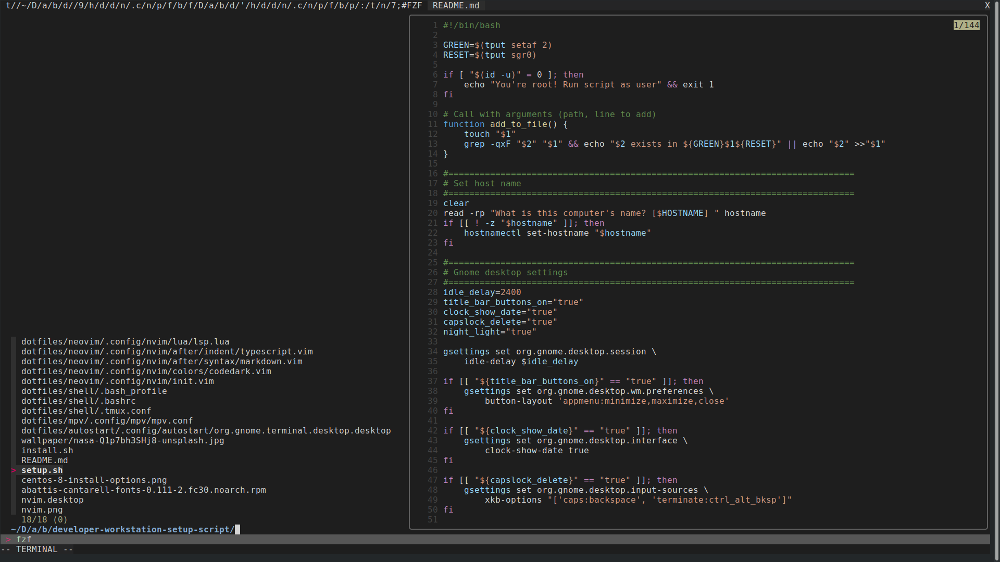

# Developer Workstation Setup Script


Welcome to your new **ultimate development environment**! A post-install setup script for developers that works on Fedora and all RHEL 8 clones. Enjoy the same software and desktop regardless of which Red Hat based distribution you choose. 


## Features

### Fedora 34+ and RHEL 8+ clones compatibility


Works across Fedora 34+, RHEL 8+ and all clones. You get to choose between cutting edge Fedora or stable RHEL clones. I suggest if you want stable, then choose Rocky.

To maintain parity with Fedora 34+, any package that is not available directly in RHEL is downloaded as:

- A binary from Github or another trusted source
- From [flathub](https://flathub.org/home)

### Great software out of the box, easy to customize and choose your own

| Development    | Browsers         | Graphics    | Sound and video | Security and backup |
| -------------- | ---------------- | ----------- | --------------- | ------------------- |
| Neovim 0.5     | Firefox          | Krita       | MPV             | KeepassXC           |
| Node.js / Deno | Chromium         | Shotwell    | Handbrake       | BorgBackup          |
| Gnome Boxes    | nnn file browser | ImageMagick | MKVToolNix      |                     |
| Lazygit        |                  |             |                 |                     |
| Github CLI     |                  |             |                 |                     |
| Pandoc         |                  |             |                 |                     |
| Shellcheck     |                  |             |                 |                     |
| Shfmt          |                  |             |                 |                     |
| Bat / ripgrep  |                  |             |                 |                     |

### Improved Gnome desktop and font settings

Gnome has been tweaked along with font settings for a better experience.

### Neovim 0.5 with plugins and custom keybindings

Setup out of the box with the latest [Neovim 0.5](https://neovim.io/news/2021/07) and plugins configured to use `fzf`, `ripgrep` and `bat` with an attractive Visual Studio Code theme




### Uses [stow](https://www.gnu.org/software/stow/) to install and mange dotfiles

All the software dotfiles are managed using stow, this makes them easy to alter and version on your computer.

## Installation

### RHEL clones must be installed using the `workstation` option

This script is designed to be run immediately after installing the operating system. If you are using a RHEL clone you should select `workstation` from the software selection option during the install.


### Use git to clone this repository

```
git clone https://github.com/David-Else/developer-workstation-setup-script
cd developer-workstation-setup-script
```

### Customize the software selection before running the script

You will want to look at the install script and modify it with your own preferences. This has been made as easy as possible, and should be self explanatory.

The following arrays in `install.sh` contain all the packages that are common to Fedora and RHEL clones:

```bash
rpm_packages_to_remove=()
rpm_packages_to_install=()
flathub_packages_to_install=()
npm_global_packages_to_install=()
```

These arrays are global and are modified depending on if you have installed Fedora or a RHEL clone. Inside the `if then` conditional you can add and remove packages specifically for each operating system:

```bash
if [[ ("$ID" == "centos" || "$ID" == "rocky" || "$ID" == "rhel" || "$ID" == "almalinux") && "${VERSION_ID%.*}" -gt 7 ]]; then

    setup_redhat_packages() {
        local rhel_rpm_packages_to_remove=()
        local rhel_rpm_packages_to_install=()
        local rhel_flathub_packages_to_install=()
    }

elif [ "$ID" == "fedora" ]; then

    setup_fedora_packages() {
        local fedora_rpm_packages_to_remove=()
        local fedora_rpm_packages_to_install=()
    }
fi
```

Repos can be added conditionally, so if the package is not required then the repo is not installed:

```bash
    case " ${rpm_packages_to_install[*]} " in
    *' code '*)
        rpm --import https://packages.microsoft.com/keys/microsoft.asc
        sh -c 'echo -e "[code]\nname=Visual Studio Code\nbaseurl=https://packages.microsoft.com/yumrepos/vscode\nenabled=1\ngpgcheck=1\ngpgkey=https://packages.microsoft.com/keys/microsoft.asc" > /etc/yum.repos.d/vscode.repo'
        ;;&
    *' lazygit '*)
        dnf -y copr enable atim/lazygit
        ;;&
    *' gh '*)
        dnf -y config-manager --add-repo https://cli.github.com/packages/rpm/gh-cli.repo
        ;;
    esac
```

### Run the scripts

```
sudo ./install.sh
./setup.sh
```

**ENJOY!**

## Neovim keybindings and plugins used

### Neovim custom key mappings

```
 General                                      LSP
 -------                                      ---
          jk = escape                         gD        = Jumps to the declaration
      ctrl-s = save                           gd        = Jumps to the definition
 alt h/j/k/l = navigate windows               K         = Displays hover information
 ]c/[c/[l/]l = cycle quick/location lists     <C-k>     = Displays signature info
         ESC = search highlighting off        gi        = Lists all implementations
                                                          in the quickfix window
  <leader>f  = format (formatprg or LSP)      gr        = List all symbol references
  <leader>m  = run make on current buffer     <space>wa = Add workspace folder
  <leader>t  = open terminal to the right     <space>wr = Remove workstation folder
  <leader>cd = working dir to current file    <space>wl = List workstation folders
  <leader>c  = edit init.vim config           <space>D  = Jump to type definition
  <leader>o  = insert newline below           <space>rn = Rename all symbol references
  <leader>qa = quit all                       <space>ca = Selects a code action
                                              <space>e  = Show diagnostics from line
  <leader>cc = toggle colorcolumn             <space>q  = Sets the location list
  <leader>n  = toggle line numbers            [d        = Move to previous diagnostic
  <leader>s  = toggle spell check             ]d        = Move to next diagnostic
  <leader>sn = next spell error and prompt
  <leader>w  = toggle whitespaces
  <leader>z  = toggle zen mode
  
  <leader>ga = git add
  <leader>gr = git reset
  <leader>gc = git commit
  <leader>gp = git push

  fzf.vim                                      Text objects
  -------                                      ------------
  ctrl-p     = open file explorer              ["af"] = @function.outer
  <leader>b  = open buffers                    ["if"] = @function.inner
  <leader>h  = open file history               ["ac"] = @class.outer
  <leader>rg = ripgrep search results          ["ic"] = @class.inner

  <leader>gs = git status
  <leader>gh = git commits history
```

For all the Vim/Neovim built in shortcuts please check out https://www.elsewebdevelopment.com/ultimate-vim-keyboard-shortcuts/

### Neovim plugins

This is a list of all the plugins used, please follow the links to read about how to opperate them.

- [nvim-treesitter](https://github.com/nvim-treesitter/nvim-treesitter) - Nvim Treesitter configurations and abstraction layer
- [nvim-treesitter-textobject](https://github.com/nvim-treesitter/nvim-treesitter-textobjects) - Create your own textobjects using tree-sitter queries
- [nvim-lspconfig](https://github.com/neovim/nvim-lspconfig) - Quickstart configurations for the Nvim LSP client
- [nvim-compe](https://github.com/hrsh7th/nvim-compe) - Auto completion plugin for nvim written in Lua
- [nvim-lightbulb](https://github.com/kosayoda/nvim-lightbulb) - Shows a lightbulb whenever a `textDocument/codeAction` is available at the current cursor position
- [nvim-markdown-preview](https://github.com/davidgranstrom/nvim-markdown-preview) - Markdown preview in the browser using pandoc/live-server through Neovim's job-control API
- [zen-mode.nvim](https://github.com/folke/zen-mode.nvim) - Distraction-free coding for Neovim
- [which-key.nvim](https://github.com/folke/which-key.nvim) - Neovim plugin that shows a popup with possible keybindings of the command you started typing

- [vim-commentary](https://github.com/tpope/vim-commentary) - Comment stuff out
- [fzf.vim](https://github.com/junegunn/fzf.vim) - fzf vim wrapper

## FAQ

**Q**: Why is the script spit into two parts for install and setup?

**A**: Sudo privileges are needed for the installation, and they time out before the script can finish. This makes unattended installation impossible without running the install part of the script as root.

The setup part is much easier to do as a user, so running it as the user avoids constant `su - "$SUDO_USER" -c` statements in the code. If a part of the setup needs `sudo` it will ask for your password.

**Q**: Does this script disable the caps lock key? I've noticed that it works during login but after that it stops working altogether.

**A**: It makes the caps lock into a delete for touch typing purposes, to change it modify this line in the setup script:

```shell
 capslock_delete="false"
```
